  

[LinkedIn](https://www.linkedin.com/in/luizwiegert) · [Instagram](https://www.instagram.com/luizwiegert)

## Sobre

Sou estudante de Sistemas de Informação na UNIVAG e desenvolvo com IA no centro do processo: Claude Code como par de programação, servidores MCP, agentes e automações. Trato as regras de uso da ferramenta como parte da engenharia, e todo código gerado passa por revisão minha antes de entrar no repositório.

## Projetos

### [Moviegram](https://github.com/Luizwiegert/moviegram) · [ver no ar](https://moviegram-chi.vercel.app)

A linha do tempo inteira da Marvel para acompanhar com a turma: cada um marca o que já viu, dá nota, comenta e disputa o ranking até a estreia de Vingadores: Doomsday. Roda em modo demonstração sem nenhuma configuração.

`TypeScript` `Vite` `Supabase` `TMDB API` `Vercel`

### [Book-Level](https://github.com/Luizwiegert/Book-Level)

Aplicativo mobile que aplica a lógica de progressão de jogos a hábitos de leitura: cada página lida vira XP, com 50 níveis, streaks diários, 13 conquistas, grupos com chat em tempo real e ranking entre amigos.

`React Native` `Expo SDK 54` `Firebase Auth` `Firestore` `Google Books API`

### [JARVIS](https://github.com/Luizwiegert/jarvis) · em desenvolvimento

Assistente pessoal sempre ligado, com voz, memória e personalidade próprias. Um núcleo em Python conecta o Claude a um canal de voz (palavra de ativação, Whisper e fala sintetizada) e ao Telegram. O repositório público traz a arquitetura e o andamento; o código é privado.

`Python` `Claude Code` `Whisper` `openWakeWord` `Telegram Bot API`

## Stack

| Área | Tecnologias |
|---|---|
| Web | TypeScript, Vite, Supabase, Vercel |
| Mobile | React Native, Expo, Firebase |
| IA e automação | Python, Claude Code, MCP, agentes, Whisper |

  

Os cartões acima são SVGs gerados por <a href="scripts/build.py">scripts/build.py</a> e atualizados todo dia por GitHub Actions.
